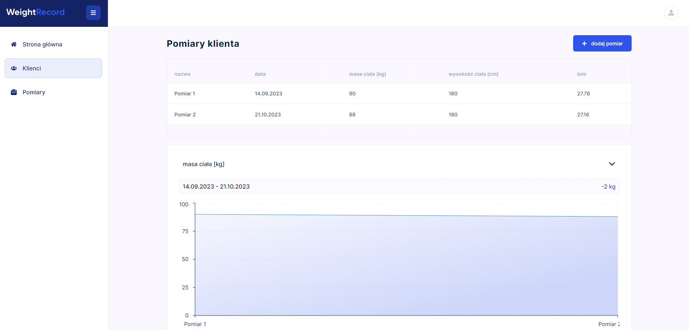

<h1 align="center">Weight Record</h1>





## Project Overview

The Weight Record application is used to create body weight measurements. In the application, you can add clients, create and analyze body weight measurements. The Next.js framework was used to build the application together with other libraries listed below.
Node.js from express.js was used to build the backend of the application. [backend repository](https://github.com/LucaMederak/WeightRecord-backend)

## Tech used

| Tech                                               | Description                                          |
| -------------------------------------------------- | ---------------------------------------------------- |
| [Next.js](https://nextjs.org/)                     | The React Framework for the Web                      |
| [Typescript](https://www.typescriptlang.org/)      | Javascript superset language                         |
| [Styled Components](https://styled-components.com) | CSS-in-JS styling framework                          |
| [SWR](https://swr.vercel.app/)                     | React Hooks for Data Fetching                        |
| [React Hook Form](https://react-hook-form.com/)    | React Hooks for form state management and validation |
| [Framer Motion](https://www.framer.com/motion/)    | Motion library for React                             |

## Live

The frontend of the application is hosted on the Vercel platform.

https://dashboard.weight-record.mederak.com

## Credentials

If you don't want to register, use this data:

- Email: jan.kowalski.test@gmail.com
- Password: jankowalskitest


## Installation

```bash
git clone https://github.com/LucaMederak/WeightRecord.git
npm install
# set up environment variables
The following environment variables are used in this project:

- `NEXT_PUBLIC_BACKEND_URL`: The URL to the hosted backend of the application.

To configure these variables, create a `.env.local` file in the root of your project.

npm run start
```
